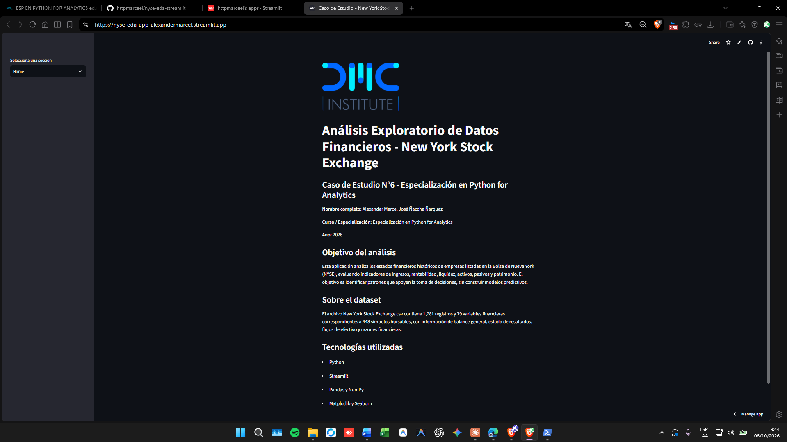
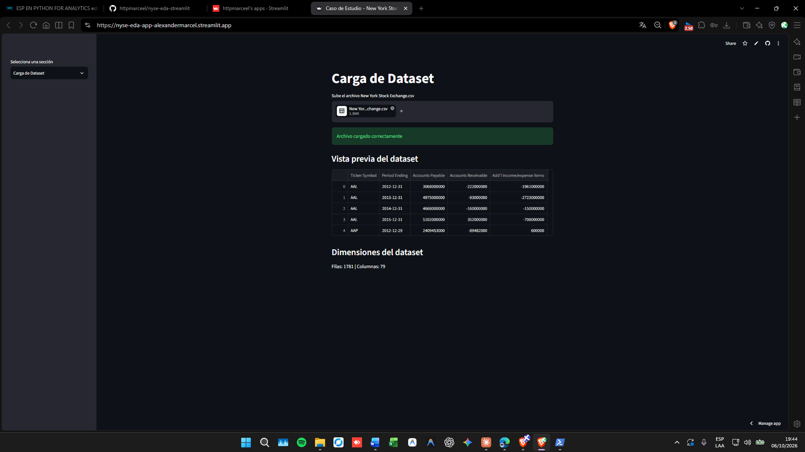
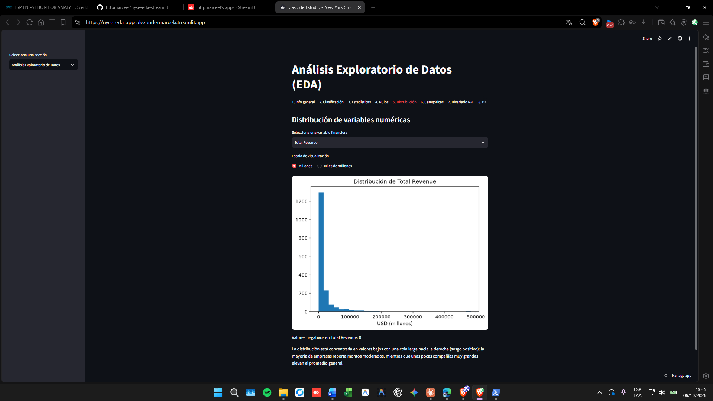
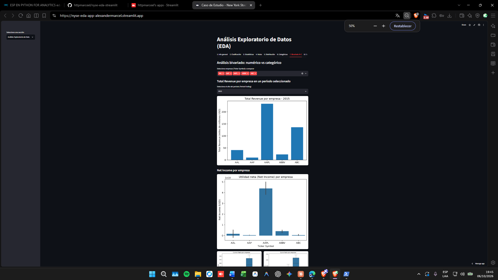
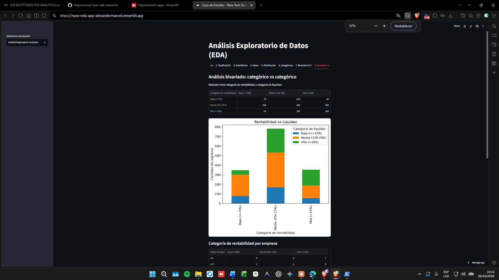
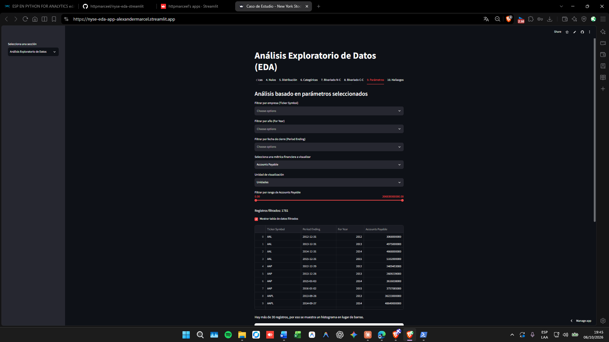
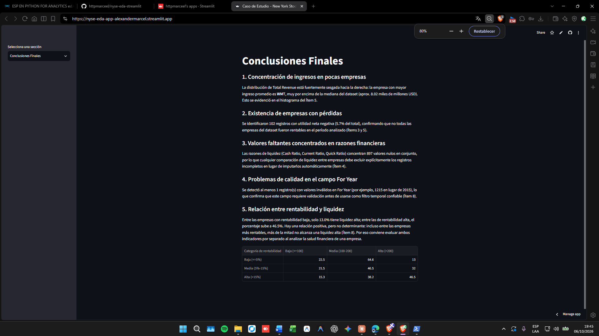

# Caso de Estudio N°6 - New York Stock Exchange

Aplicación interactiva en Streamlit desarrollada como Trabajo Final de la Especialización en Python for Analytics. Realiza un Análisis Exploratorio de Datos (EDA) sobre estados financieros históricos de empresas listadas en la Bolsa de Nueva York (NYSE).

**Autor:** Alexander Marcel José Ñaccha Ñarquez

## Descripción del proyecto

La aplicación permite cargar el dataset `New York Stock Exchange.csv` y explorar sus variables financieras (ingresos, utilidades, activos, pasivos, patrimonio y razones de liquidez) mediante estadística descriptiva y visualizaciones, con el objetivo de identificar patrones que apoyen la toma de decisiones. No se construyen modelos predictivos.

## Contenido de la app

- **Home**: presentación del proyecto y datos del autor.
- **Carga de Dataset**: carga del archivo CSV mediante `st.file_uploader()`, validación y vista previa.
- **Análisis Exploratorio de Datos**: 10 ítems de análisis organizados en pestañas (información general, clasificación de variables, estadísticas descriptivas, valores faltantes, distribución, variables categóricas, análisis bivariado numérico-categórico, análisis bivariado categórico-categórico, análisis por parámetros seleccionados y hallazgos clave).
- **Conclusiones Finales**: 5 conclusiones basadas en los resultados del EDA.

## Cómo ejecutar la app localmente

```bash
pip install -r requirements.txt
streamlit run app.py
```

Luego, dentro de la app, sube el archivo `New York Stock Exchange.csv` en la sección "Carga de Dataset" para habilitar el análisis.

## Descripción breve de las variables principales

| Variable | Descripción |
|---|---|
| Ticker Symbol | Símbolo bursátil de la empresa |
| Period Ending | Fecha de cierre del período financiero |
| Total Revenue | Ingresos totales |
| Net Income | Utilidad neta |
| Total Assets | Activos totales |
| Total Liabilities | Pasivos totales |
| Total Equity | Patrimonio total |
| Current Ratio | Razón corriente |
| Quick Ratio | Razón rápida o prueba ácida |
| Profit Margin | Margen de utilidad |
| For Year | Año fiscal reportado |

El diccionario completo de las 79 variables se encuentra en el PDF del caso de estudio proporcionado por el curso.

## Archivos del proyecto

- `app.py`: aplicación principal.
- `New York Stock Exchange.csv`: dataset utilizado.
- `requirements.txt`: dependencias del proyecto.
- `logo-secundario-dmc-institute-01.png`: logo mostrado en la sección Home.
- `capturas/`: capturas de pantalla de la aplicación.

## Capturas de la aplicación

**Home**



**Carga de Dataset**



**EDA - Distribución de variables numéricas**



**EDA - Análisis bivariado (numérico vs categórico)**



**EDA - Análisis bivariado (categórico vs categórico)**



**EDA - Análisis basado en parámetros seleccionados**



**Conclusiones Finales**



## Links relevantes

- Repositorio GitHub: https://github.com/httpmarceel/nyse-eda-streamlit
- Aplicación desplegada en Streamlit Cloud: https://nyse-eda-app-alexandermarcel.streamlit.app/
